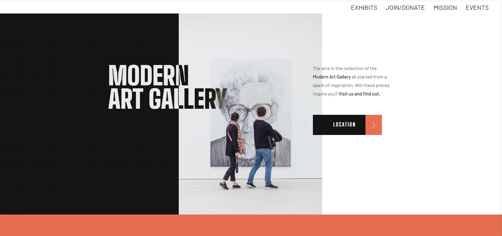

# Art Gallery Redesign

## Table of contents

- [Overview](#overview)
  - [The challenge](#the-challenge)
  - [Screenshot](#screenshot)
  - [Links](#links)
- [My process](#my-process)
  - [Built with](#built-with)
  - [What I learned](#what-i-learned)
  - [Continued development](#continued-development)
  - [Useful resources](#useful-resources)

## Overview
Redesign an Art Gallery webpage by updating html, css & js. Adding new features such as navbar, return to top button, exhibit display, events and mission statement.

### The challenge

Users should be able to:

- View the optimal layout for the site depending on their device's screen size
- See hover states for all interactive elements on the page
- Access location of museum using location button

### Screenshot

### Links

- Solution URL: https://github.com/Jud1th1/art_gallery
- Live Site URL: https://modern-art-gallery-mag.netlify.app/

## My process
-after reviewing the files to get familiar with the layout, class names, and CSS styling, I decided to maintain the look since it was impressive but added some extra features that users may like such as a navigation bar, exhibit display, mission statement and event cards.
- I also changed the brown to orange for a bright pop of color with a lighter orange as an accent seen throughout my links and buttons. I added a sans-serif font to the body that matched the heading fonts and then created my other elements 
- the nav bar was made using flex and it was set to row-reverse so that it could stay on the right side of the screen occupying the side of the header with the most negative space. I added a white background to slide in on top of the orange body when the site loads. I did not want a fixed nav, because it took away from the webpage design so I added a button to go back to the top of the page once you’ve scrolled away from the top with JavaScript.
- the exhibit area was made with a grid so that I could align 3 images and their respective text side by side horizontally. The grid also made it easy to be responsive while maintaining the spacing between each exhibit item listed. 
- the mission was fairly easy, I adopted the heading and paragraph fonts from the document and aligned my text to be centered with padding to sit in the middle. I added a large button as a call to action to the viewer to learn more about the gallery and practiced using some animation here to increase the button size.
- The events section was also a grid layout where I had to manipulate the image size to fit my container. This was easier to maintain in mobile view by setting my image width to 100%. 
- Then I changed the images in the image grid to match more of my orange theme as well as change the text to a join and donation area. I added links here that the user would press if they were interested and because I noticed these links came out blue when inversed, I changed the links to my exhibit and events to blue as well for cohesiveness. 
- finally, I worked on the mobile view to make sure the webpage was responsive. For the most part, it was, with the exception of some images and my events and exhibit grids - but all I had to change here was the number of columns and adjust the height of my images. 

### Built with

- Semantic HTML5 markup
- CSS custom properties
- Javascript
- Flexbox
- CSS Grid
- Desktop-first workflow

### What I learned

-	Working on a file previously styled as opposed to starting fresh helped me learn how to read and interpret the work of others. I paid careful attention to the layout and styling so I knew what I could change, and what would be affected due my changes. Overall, it took some time and there were a few hurdles due to trial and error, but I am happy with my end result. 

### Continued development

-	After working with this file, I realized I could use more practice with animations and transitions. Sometimes my intended design would not go as planned and I spent quiet some time trying to understand what went wrong.  

### Useful resources

- w3schools

